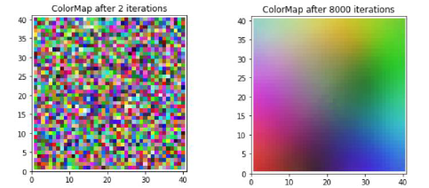

#  Color Map

1. Initially, generate 1600 RGB colors at random. Values for Red, Green, and Blue must all be in the range 0 to 255.

2. This dataset of 3D data is then represented into a 40x40 grid
map of nodes, which can be shown as a picture with height and width of 40 pixel.

The goal is to take the 3D color vectors and map them onto a 2D surface in such a way that similar colors will end up in the same area of the 2D surface. 
## Image
This is the final result of Color Map.

</img> 

## Language 
This project is written in python.

## Contributing
Pull requests are welcome. For major changes, please open an issue first to discuss what you would like to change.

Please make sure to update tests as appropriate.
